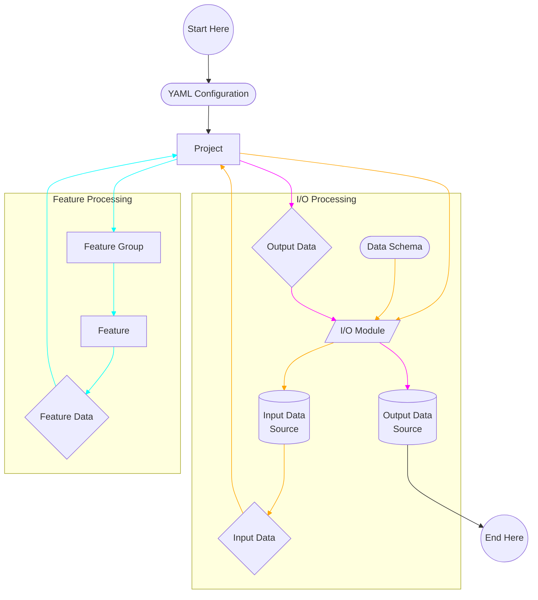

RADAR Pipeline is an open-source python package to help researchers and users working with RADAR data to ingest, analyze, visualize, and export their data, all from a single place. The package is designed to be flexible and extensible. The pipeline aims to:

-   Allow researchers to create and publish their own custom pipelines to analyze and visualize their data in a reproducible and extensible way.
-   Allow users to consume and run published pipelines and run their own analysis on their data.
-   Finalised pipelines should be published where possible into the **RADAR-base Analytics Catalogue** GitHub Organisation see https://github.com/RADAR-base-Analytics and you may provide a CITATIONS.cff file so the repository can be found reused and cited by the community.

## Getting Started

The pipeline is still in the development phase. If you are interested in contributing, please refer to the [contributor guide](#contributor-guide) below.

The best way to start with the pipeline would be to [install it](index.md) and do a [Mock Pipeline](https://github.com/RADAR-base/radar-pipeline/wiki/Mock-Pipeline) run. This would give you an idea of the different parts of the pipeline and what a typical run of the pipeline looks like to the user. We are working on publiszhing more exemplar pipelines to help researchers with a variety of configurations get started with the project and integrate it to publish their own pipelines faster.

If you face any issue, please feel free to open a [discussion](https://github.com/RADAR-base/radar-pipeline/discussions) or an [issue](https://github.com/RADAR-base/radar-pipeline/issues) on GitHub.

## Installation

See [Installation Instructions](https://github.com/RADAR-base/radar-pipeline/wiki/Installation#installation-instructions)

## Implementation Details

The functioning of the pipeline can be divided into two modules:

-   I/O Processing - Ingesting and Exporting data
-   Feature Processing - Processing, Analyzing and Visualizing data

The flowchart below illustrates these two modules, as well as how data flows in the pipeline.

The pipeline is implemented in Python and makes use of Spark through [pySpark](https://spark.apache.org/docs/latest/api/python/) to store the data as a Spark DataFrame when the pipeline is running.

We chose to use Spark as the data store of the pipeline because of its scalability, support for parallel processing, stability and compatibility with a wide variety of data formats.

## Contributor Guide

If you are interested to contribute to RADAR Pipeline, please refer to the [Contributor Guide](https://github.com/RADAR-base/radar-pipeline/wiki/Contributor-Guide).

